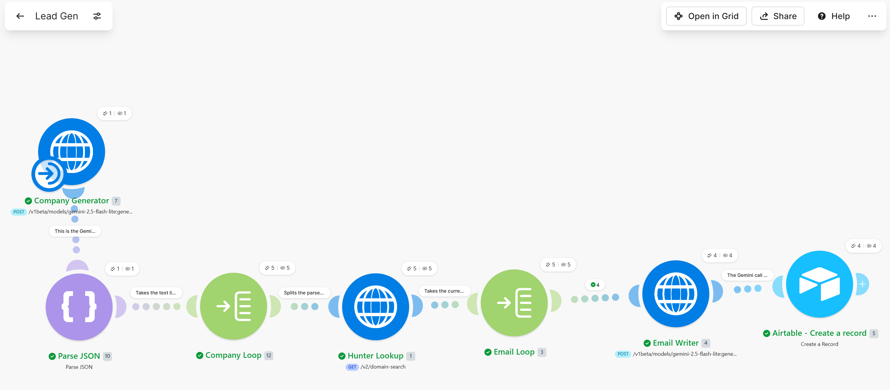
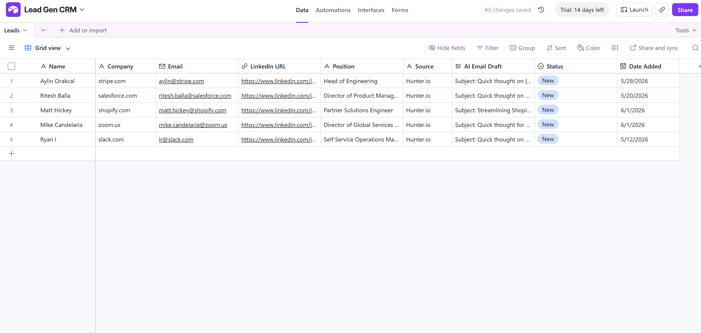

# AI Lead Generation Engine

An automated lead generation pipeline that sources target companies using AI, finds real contacts at each one, writes a personalized cold email for every contact, and logs everything into a structured CRM. The entire workflow runs end to end with a single trigger.

Built with **Make**, **Hunter.io**, **Google Gemini**, and **Airtable**.

---

## The Problem

Early-stage outreach is slow and manual. Finding leads, looking up contact details, and writing a personalized first email for each one can take 15+ hours a week, and most of it is repetitive work that does not scale.

I wanted to see how much of that pipeline could run on its own, from sourcing companies all the way to a ready-to-send draft, without manual prospecting or copy-pasting into spreadsheets.

---

## What It Does

1. **Generates target companies** using Gemini, which returns a structured list of real SaaS companies.
2. **Finds contacts** at each company via the Hunter.io domain search API.
3. **Loops through every contact** and uses Gemini to write a personalized cold email with a subject line.
4. **Filters out** role-based and incomplete contacts so only real, named people are kept.
5. **Logs each lead** into an Airtable CRM with name, company, email, role, the AI-written draft, and a status.

---

## Architecture

The pipeline uses a nested-loop design: an outer loop over companies, and an inner loop over each company's contacts.

**Flow:** Generate companies → Parse JSON → Company loop → Find emails (Hunter) → Email loop → Write email (Gemini) → Add to CRM (Airtable)

---

## Tech Stack

| Tool | Role |
|------|------|
| Make | Orchestration and workflow logic |
| Google Gemini | Company generation + email writing |
| Hunter.io | Contact discovery (domain search) |
| Airtable | CRM / structured data store |

---

## Key Decisions and Learnings

- **Data quality over volume.** I added a filter so only contacts with a real name pass through, dropping generic role-based emails. A clean CRM of real people beats a large list of noise.
- **Structure forces AI reliability.** Left loosely instructed, the model skipped subject lines and ignored format rules. Enforcing a rigid output format and using Gemini's JSON response mode made the output consistent.
- **Nested loops were the hardest part.** Understanding why one iterator sits inside another, and how data references change across loop levels, was the core technical challenge.
- **Reading errors beats guessing.** Most of the build was careful debugging: auth scopes, empty-bracket mappings, and out-of-order module runs.

---

## Limitations and Next Steps

- AI-generated company lists occasionally include domains that do not resolve; a verified data source would improve reliability in production.
- Currently appends records without deduplication; a "check if exists" step would prevent duplicates across runs.
- Could add an enrichment step (e.g. Hunter Company Enrichment) for firmographic data like employee count.
- A scheduled trigger could run it automatically; kept manual here to respect free-tier API limits.

---

## Screenshots

*(Add your screenshots here once uploaded, e.g.)*

